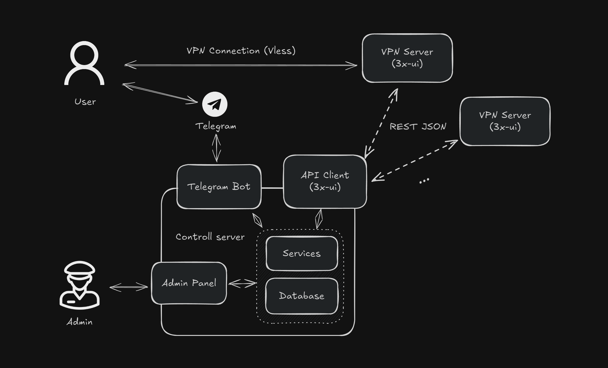

# VPN Telegram Bot

The application provide managment of VPN (3x-ui) subscriptions and serving it over Telegram Bot. Admin
managment is carried out through web admin panel (Go+HTMX).

Project consists of loosely coupled parts, where each be can replaced with minimum efforts:
- Telegram Bot 
  - Path: `internal/bot/telegram`
  - Framework: [Telebot](https://github.com/tucnak/telebot)
- Web Admin panel 
  - Path: `web/admin_panel`
  - Framework: [templ](https://github.com/a-h/templ), [HTMX](https://htmx.org/), [Tailwind Css](https://tailwindcss.com/) (theme [franken-ui](https://github.com/franken-ui/ui))
- Storage*
  - Path: `internal/storage/sqlite`
  - BD: [sqlite3](https://github.com/mattn/go-sqlite3)
- VPN API client
  - Path: `pkg/clients/x-ui`
  - Target: [3x-ui](https://github.com/MHSanaei/3x-ui)
- Services

## Installation

### For Development
Clone the repo \
`git clone ...`\
Install development go packages \
`go install`\
`go install github.com/a-h/templ/cmd/templ@latest`\
For auto rebuild install Air.\
`go install github.com/air-verse/air@latest`\
Install npm packages for Tailwindcss\
`cd ./web/admin_panel/ && npm install`

## Run for development

Provide enviroment variables, example of which are given in `template.env` file.

Create test database with command\
`make test-db`

### Run admin panel (with Go air)
Admin panel provide managment for Users, Server, Subscriptions. \
To start the panel run:\
 `make admin` \
Open provided host in web browser.

### Run Telegram Bot (with Go air)
To run bot for Telegram you need provide a valid bot's *token*. ([See official guide](https://core.telegram.org/bots/tutorial))\
To start Telegram bot run:\
`make tg` \
Open the Telegram Bot, which Token been provided.

## Deployment

Telegram Bot and Admin Web Panel can run on a sigle server as monolith, or as separate services.

Meanwhile, there can be unlimited VPN servers (3x-ui), that could be deployed on different locations. One of it can be at the same server with contoll apps, though.

To add new server to VPN network, you need firstly to
1. Deploy [3x-ui panel](https://github.com/MHSanaei/3x-ui) on a server. It can be do with docker-compose (see `/web/3x-ui/docker/`). Recommended to correctly configure firewall.
2. Get your authorization data (login, passord) from 3x-ui panel on a new server.
3. Register new server in Admin panel:
   - Open Admin web panel in web browser;
   - Navigate to `Servers -> Add new server`;
   - Create new server with given credentials.
4. [Unimplemented] For automatic configuration press "Configure"

## Footnotes

\* To provide another storage solution need to implement
 -  `internal/storage/storage.go`
 -  `pkg/sqlbuilder/builder/*.go`